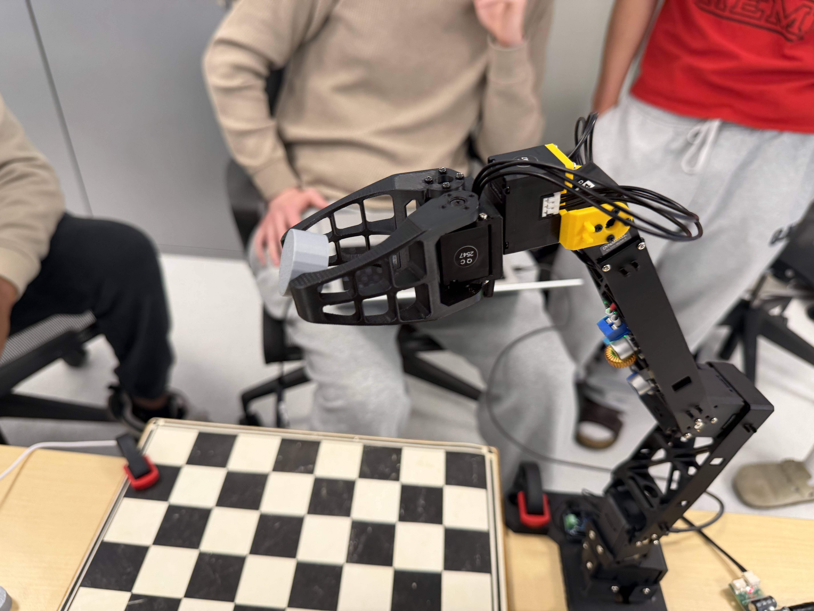
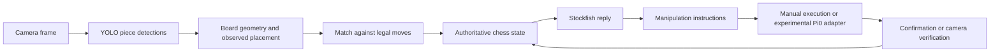
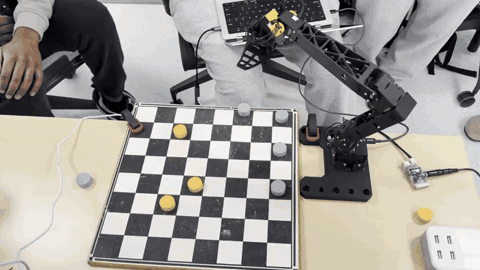
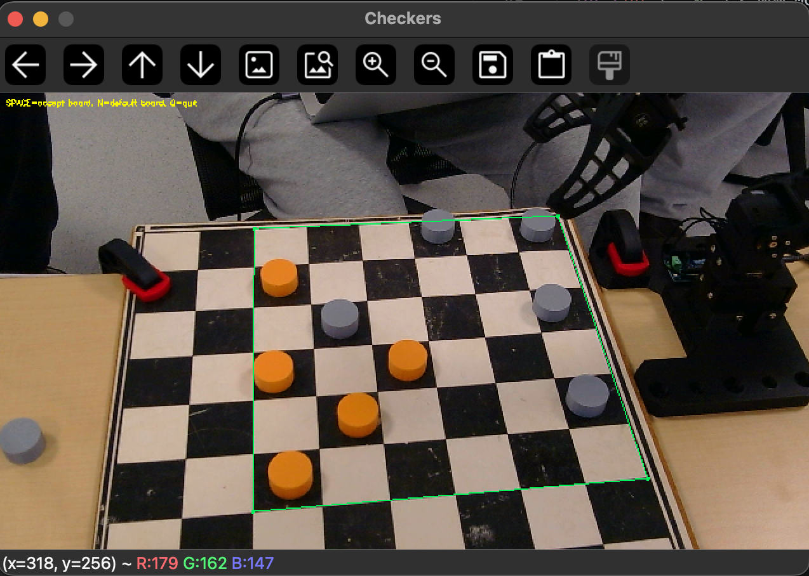
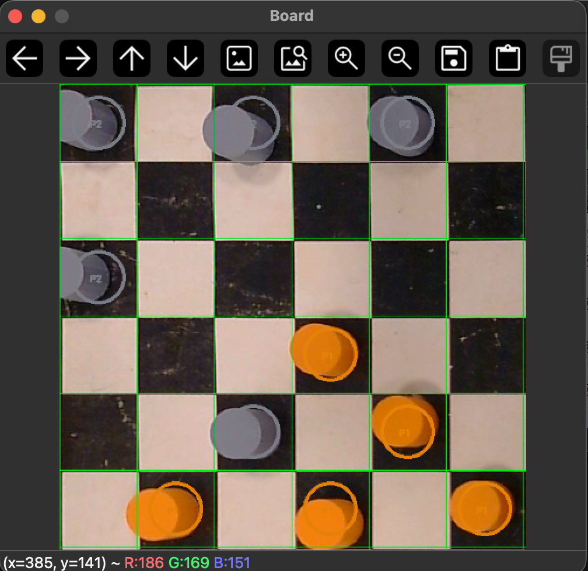

# Little Robot Chess Player

A robotics project connecting **chessboard perception, Stockfish move selection, and language-conditioned manipulation**.

The chess software lives here: detect pieces, recover a legal human move, choose a reply, and translate it into pick-and-place instructions. The physical platform is an OMX robot arm; the experimental motion adapter targets LeRobot Pi0.

**Current status:** the software demo and regression suite run without hardware. End-to-end physical chess play has not been verified in this revision.



*Hardware from the related ROB 400 checkers project. This photograph documents the physical prototype, not autonomous chess execution.*

[Try the demo](#try-it-without-a-robot) · [How it works](#how-it-works) · [Prototype media](#physical-prototype) · [Hardware validation](docs/hardware.md)

## Try it without a robot

Python 3.10 or newer:

```bash
git clone https://github.com/ichen27/lerobot-chess-player.git
cd lerobot-chess-player
python -m venv .venv
source .venv/bin/activate
python -m pip install -e ".[dev]"
chess-demo
python -m pytest -q
```

The demo follows a reproducible opening: white plays `e2e4`, black replies `e7e5`, and the planner produces:

```text
pick black pawn from e7, place on e5
```

It validates both moves and prints the before/after FEN and manipulation instructions as JSON. **The default reply is scripted** so this example needs no camera, model weights, robot, or Stockfish installation. It exercises move recovery and planning, not perception or motion.

To have Stockfish select the reply:

```bash
brew install stockfish                     # macOS; Ubuntu: sudo apt install stockfish
chess-demo --stockfish "$(command -v stockfish)"
# On Ubuntu the executable may be /usr/games/stockfish.
```

With [uv](https://docs.astral.sh/uv/), use `uv sync --locked --extra dev`, then `uv run chess-demo` and `uv run pytest -q`. The lockfile records a resolved dependency set.

## How it works



- **Perception:** OpenCV estimates the board corners; a perspective transform maps detections to squares. Off-board detections are discarded, and the strongest detection wins when multiple boxes occupy a square. Unknown piece labels produce an explicit error.
- **Game state:** an image shows piece placement, not castling rights or move history. Human moves are accepted only when an exact legal move produces the observed placement.
- **Planning:** captures remove the captured piece first; castling includes the rook move; en passant removes the pawn from its actual square. Promotion produces a manual replacement instruction.
- **Execution:** manual mode requires confirmation. The experimental arm path must finish without an exception and produce a matching camera observation before the internal board advances.

## Physical prototype

These photos and videos come from the related [robotics-final](https://github.com/ichen27/robotics-final) course project, which uses checkers pieces. They provide context for the arm, gripper, board, and camera work. That repository may require access.

[](docs/media/checkers-prototype.mp4)

*12-second excerpt at original speed. [Watch the 21-second clip](docs/media/checkers-prototype.mp4). Footage is not an end-to-end chess benchmark.*

<table>
<tr>
<td></td>
<td></td>
</tr>
<tr><td>Board boundary in the camera view</td><td>Rectified checkers grid and piece detections</td></tr>
</table>

[Media origin and processing details](docs/media/README.md)

## Run chess perception

Install the optional vision dependencies and supply trained chess-piece weights:

```bash
python -m pip install -e ".[vision]"
python play_chess.py \
  --yolo-weights /absolute/path/to/chess-best.pt \
  --stockfish "$(command -v stockfish)" \
  --camera 0
```

Start from the standard chess position. Play white and press Enter to scan your move. Without a Pi0 model, the program prints black's instructions; perform them yourself and type `y` to confirm.

The repository does **not** bundle trained weights or claim that a general YOLO model recognizes chess pieces. Missing weights produce an error. See [models and training](docs/models.md) for the retained training artifacts and class-label constraints.

Automatic board detection is a geometric heuristic. Inspect its result before relying on it, use a fixed camera and clear board boundaries, and keep the board orientation consistent (`--orientation black_bottom` is available).

## What is verified

| Component | Evidence and boundary |
| --- | --- |
| Board-to-square mapping | Regression tests for confidence ordering, orientation, off-board detections, malformed labels and geometry |
| Chess logic and manipulation planning | Legal-move matching, captures, castling, en passant, promotion, and illegal-observation tests |
| Software-only demo | Runs in a clean core environment with no deep-learning packages |
| Move completion | Tests for manual confirmation, execution failure, and mismatched post-move observations |
| Pi0 adapter contract | Tests with synthetic tensors and simulated camera/arm boundaries; requires the vision extra to run these tests |
| Physical chess gameplay | Pending validation with the actual arm, camera, calibration and compatible checkpoint |

The default tests deliberately exclude the interactive hardware utilities in `scripts/`. The core install skips the optional tensor-policy test module; `pip install -e ".[dev,vision]"` enables the complete software suite. GitHub Actions defines both core and vision test jobs.

[Recorded software validation](docs/validation.md)

## Hardware integration

The Pi0 runner is **experimental**. It targets the older ROBOTIS LeRobot 0.3.4 interface and needs a matching checkpoint, normalization statistics, camera feature and joint ordering. Newer LeRobot versions have a different preprocessing contract.

The program now propagates model/connection/execution failures instead of silently switching modes. A fixed number of policy steps is not proof of a completed move; post-move board verification is required. Physical promotion is blocked until a manual replacement flow is validated.

[Hardware setup boundaries and validation procedure](docs/hardware.md)

## Repository map

```text
chess_perception/
  board.py       Board geometry, square mapping and FEN serialization
  detect.py      Optional YOLO detector
  engine.py      Stockfish integration
  pipeline.py    Frame perception and optional position analysis
  game.py        Legal move recovery, manipulation planning and game loop
  demo.py        Hardware-free example
tests/           Automated software regression tests
docs/            Model notes, hardware validation and attributed media
scripts/         Original training and interactive research utilities
weights/         Retained training configuration and metrics (no checkpoints)
```

## Project context and attribution

This repository explores the chess extension alongside a course checkers prototype. The course media is included with its original context; it is not presented as a demonstration of Pi0 chess gameplay or as evidence of individual ownership of every team component.

Built with [python-chess](https://python-chess.readthedocs.io/), [Stockfish](https://stockfishchess.org/), [Ultralytics](https://github.com/ultralytics/ultralytics), [OpenCV](https://opencv.org/) and [LeRobot](https://github.com/huggingface/lerobot). Dataset provenance is retained in `data/chess_pieces/`.

The original README stated MIT, but the repository did not include a license file. License clarification remains pending; dependencies, datasets and model artifacts retain their own terms.
