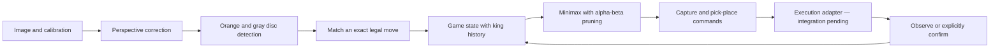
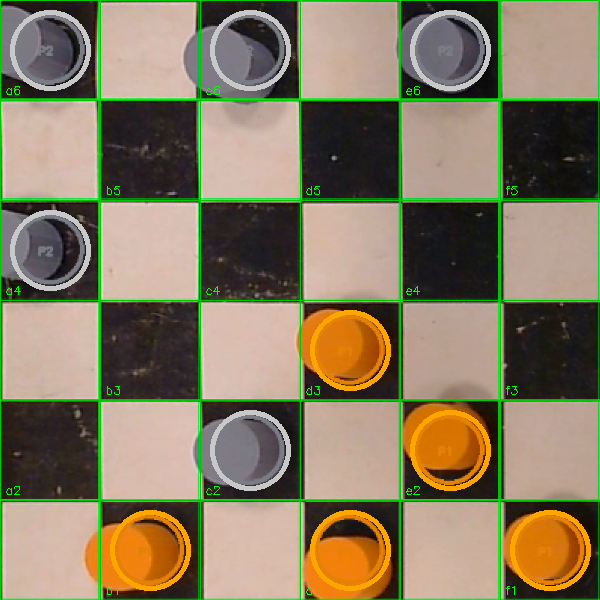

# Little Robot Checkers Player

**A checkers-playing robot project combining board perception, game search, and pick-and-place planning.**

The physical prototype uses orange and gray discs on a tabletop board. This repository provides a playable checkers engine, calibrated OpenCV perception, and a command planner for a robot arm. The default is the **6×6 playing region shown in the prototype screenshots**; an 8×8 mode is also available.


*The physical checkers prototype. The software in this revision is tested without an arm; automated execution on the robot is the next integration step.*

[Play locally](#play-without-a-robot) · [Inspect the sample board](#run-board-perception) · [Prototype footage](#physical-prototype) · [Hardware integration](docs/hardware.md)

## Play without a robot

Python 3.10 or newer. The game and opponent need **no external runtime dependencies, model weights, or hardware**.

```bash
git clone https://github.com/ichen27/lerobot-chess-player.git
cd lerobot-chess-player
python -m venv .venv
source .venv/bin/activate
python -m pip install -e ".[dev]"
checkers-play
```

You play orange; minimax plays gray. Enter `a2-b3` for a simple move, `a2xc4xe6` for a complete capture sequence, `?` for legal moves, or `q` to quit. The terminal prints the opponent's manipulation plan as a preview. It never connects to a robot.

For a reproducible JSON demo, an 8×8 game, and tests:

```bash
checkers-demo
checkers-play --size 8
python -m pytest -q
```

The demo validates an orange opening, recovers it from the resulting piece layout, chooses a real minimax reply, and outputs the move, commands, and resulting board. Search depth is configurable with `--depth` (default 4).

With [uv](https://docs.astral.sh/uv/): `uv sync --locked --extra dev`, then `uv run checkers-play`.

## How it works



| Layer | What it does |
| --- | --- |
| **Perception** | Rectifies a calibrated board and classifies disc ownership using HSV color ranges. No trained neural model is required. |
| **Rules** | Enforces mandatory captures, complete jump sequences, forward-moving men, bidirectional kings, and promotion. |
| **Opponent** | Searches legal continuations using minimax and alpha-beta pruning with material and advancement scoring. |
| **Planning** | Emits a capture-removal command for each jumped piece, a pick/place command for each leg, and a manual crowning instruction. |
| **State verification** | Commits a planned turn only after every command succeeds and a supplied observation matches, or an operator explicitly confirms. |

The 6×6 variant starts with six pieces per side and a dark upper-left square. The 8×8 mode starts with twelve per side and standard playable-square parity. Orange moves toward higher ranks. Movement follows [English checkers rules](https://wcdf.net/rules/rules_of_checkers_english.pdf): men capture forward, a capture is mandatory, and reaching the king row ends that turn. Draw adjudication and tournament clocks are not implemented.

Color alone does not distinguish men from kings. King status is retained in the game history, and crowning requires manual handling. Image-based move recovery rejects ambiguous or illegal layouts.

## Run board perception

```bash
python -m pip install -e ".[vision]"
checkers-inspect docs/media/checkers-board.png \
  --calibration examples/screenshot-calibration.json \
  --output /tmp/checkers-analysis.png
```

The included calibration finds **5 orange and 5 gray discs** in the supplied screenshot. The regression test checks their exact squares against a manually inspected reference. This is a single calibrated image check, not a general camera-accuracy benchmark.

<table>
<tr>
<td></td>
<td></td>
</tr>
<tr><td>Supplied prototype screenshot</td><td>Output generated by this revision</td></tr>
</table>

The example calibration is specific to that screenshot. For another image, supply its board corners, orientation, playable-square parity, and measured color ranges. See [perception and calibration](docs/perception.md).

## Physical prototype

[](docs/media/checkers-prototype.mp4)

*12-second excerpt at original speed. [Watch the full 21-second clip](docs/media/checkers-prototype.mp4).*


The owner-supplied photos and footage document a course checkers prototype and its physical setup. They predate this software revision and do not establish that the new engine or command planner has run on the arm. [Media sources and processing](docs/media/README.md).

## Validation and next step

The automated suite covers rules, search, multi-capture planning, failed execution, rejected observations, geometry, color classification, the supplied screenshot, and command-line play. GitHub Actions runs the dependency-free game on Python 3.10 and 3.12 and the vision suite on Python 3.11.

**Hardware execution is pending.** There is currently no motor-control or LeRobot policy backend wired to these commands. The tested `Session` interface is the boundary for a calibrated adapter; camera streaming and physical move recovery must also be integrated and tested on the actual setup. [Hardware validation procedure](docs/hardware.md) · [Recorded software checks](docs/validation.md).

## Code map

```text
checkers_robot/
  rules.py       Immutable positions and legal checkers moves
  engine.py      Minimax opponent with alpha-beta pruning
  game.py        Observation matching, command planning, verified transactions
  vision.py      Optional OpenCV board rectification and disc detection
  cli.py         Interactive software game
  demo.py        Reproducible JSON demo
examples/        Calibration for the supplied screenshot
tests/           Software regression tests
docs/            Calibration, hardware procedure, and prototype media
```

The earlier chess experiment remains available in Git history. This revision is focused on checkers. OpenCV and NumPy are optional vision dependencies. No claim of individual ownership of every course-team component is made; the repository does not currently include a project license.
